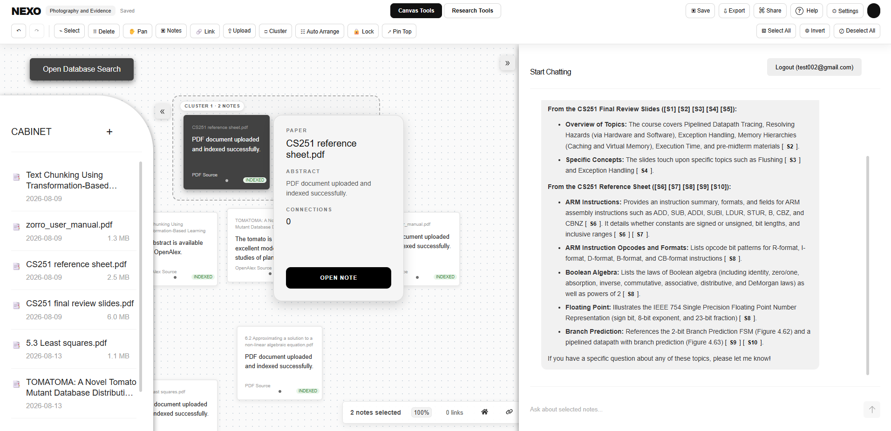

# NEXO — Multimodal AI Research Platform


NEXO is a full-stack multimodal research platform that helps users organize sources, upload documents, explore databases, and interact with AI in a visually structured workspace.

The platform combines:

- document upload and indexing
- OCR and text extraction
- note-based visual organization
- source clustering and linking
- database search
- retrieval-augmented generation (RAG)
- multimodal AI workflows
- source-grounded research assistance

This project advanced to the **Hult Prize national round**.

**Live demo:**  
https://nexo-art-research.vercel.app/

---

## Overview

Traditional research workflows often split notes, PDFs, ideas, databases, and AI tools across multiple disconnected platforms.

NEXO brings them together into one workspace where users can:

- upload and index research documents
- organize notes visually on a canvas
- cluster related materials
- search external research sources
- ask questions using selected context
- generate structured research outputs

The goal is to make AI-assisted research more visual, organized, and source-aware.

---

## Core Features

### 1. Document Upload and Indexing
Users can upload research materials such as PDFs and bring them into the workspace.

Current workflow supports:

- document upload
- indexing
- source attachment to notes
- document availability inside the workspace

---

### 2. Canvas-Based Research Workspace
NEXO provides a visual canvas where users can work with notes and documents spatially.

Users can:

- place notes on a shared canvas
- drag and organize materials
- build visual research structure
- connect related sources and ideas
- cluster notes by topic

This helps turn the workspace into a thinking surface rather than just a file list.

---

### 3. Research Database Search
NEXO includes a database-search workflow that lets users discover relevant external research materials.

Supported workflow includes:

- title / topic / keyword search
- filtering results
- reviewing record details
- following source links
- importing useful material into the workspace

This extends research beyond the user’s personal archive.

---

### 4. Context-Aware AI Chat
NEXO supports AI interaction directly inside the workspace.

Users can:

- ask general questions
- select one or more notes
- receive responses grounded in selected source material
- use follow-up prompts to continue the investigation

The purpose is to keep AI answers closer to source context rather than isolated one-shot prompting.

---

### 5. Research Tools
NEXO includes structured AI tools that help users move beyond general chat.

Current research-tool workflows include:

- **Summary** — bring together the main ideas from selected materials
- **Compare** — compare sources, arguments, or interpretations
- **Find Evidence** — identify useful support for a developing claim
- **Find Gaps** — highlight missing context, evidence, or open questions
- **Framework** — structure a research approach around selected materials
- **Outline** — turn connected ideas into an initial writing structure

These tools are intended to support real academic and analytical workflows.

---

## Product Workflow

A simplified NEXO workflow looks like this:

```text
Documents / Notes / Sources
            │
            ▼
     Upload / Index / Organize
            │
            ▼
      Visual Canvas Workspace
            │
   ┌────────┼────────┐
   ▼        ▼        ▼
Cluster    Link    Database Search
   │        │           │
   └────────┴─────┬─────┘
                  ▼
           Context Selection
                  │
                  ▼
              AI Tools
                  │
                  ▼
     Grounded Research Output
```

---

## Example Use Cases

NEXO is designed for research-oriented workflows such as:

- academic reading and note synthesis
- document comparison
- source-grounded writing preparation
- evidence collection
- visual idea development
- interdisciplinary research support
- multimodal research involving both text and images

---

## Technology Stack

### Frontend
- React
- JavaScript
- HTML / CSS

### Backend / Platform
- Node.js
- Express
- REST-style application workflows

### AI / Data Workflows
- Python
- OCR
- embeddings
- vector retrieval
- RAG
- multimodal AI integration

### Deployment / Tooling
- Vercel
- Git / GitHub

> Some AI and data-processing components are developed across connected NEXO repositories as the platform continues to evolve.

---

## Project Structure

Current top-level structure includes:

```text
Nexo-Art-Research-RAG/
├── my-express-app/
├── my-react-app/
├── public/
├── src/
├── .env.example
├── .gitignore
├── README.md
├── eslint.config.js
├── index.html
├── package.json
├── package-lock.json
└── vercel.json
```

This structure reflects the ongoing evolution of the product and may be further cleaned up as development continues.

---

## Current Product Areas

The platform currently focuses on five main product areas:

1. **Input**  
   Bring in notes, documents, and research materials.

2. **Organization**  
   Arrange content visually through the canvas, links, and clusters.

3. **Discovery**  
   Search for new sources through the database-search workflow.

4. **Interaction**  
   Use AI chat with selected source context.

5. **Research Development**  
   Apply structured tools like summary, compare, evidence, gaps, framework, and outline.

---

## Screenshots / Demo Areas

Suggested screenshots to include in the portfolio version of this repo:

- main canvas workspace
- onboarding / help page
- clustering workflow
- database-search interface
- context-aware chat interface
- research tools panel

If these images are added, they can be placed in:

```text
assets/images/
```

and referenced here later.

---

## Current Status

**Active development — 2026**

Current validated areas include:

- NEXO live web deployment
- workspace UI
- note organization
- clustering workflow
- source selection
- database-search interface
- context-aware AI interaction
- research tools framework
- multimodal platform direction

---

## Future Development

Planned development includes:

- stronger RAG grounding
- improved citation workflows
- tighter multimodal AI integration
- better document parsing and chunking
- expanded database connectors
- improved research-tool outputs
- cleaner source-to-answer traceability
- stronger cross-repository integration with NEXO AI subsystems

---

## Related NEXO Repositories

This repository represents the main NEXO platform experience.

Related work may include:

- multimodal AI / vision-language model development
- dataset crawling and research-source ingestion
- LiDAR / other technical side projects in separate repositories

---

## Author

**Tom Li**  
Computer Engineering — University of Waterloo

Areas of interest:

- AI systems
- multimodal AI
- RAG
- full-stack development
- robotics
- research tools
- autonomous systems

GitHub: [Ashen2-1](https://github.com/Ashen2-1)

---

## Live Demo

https://nexo-art-research.vercel.app/
